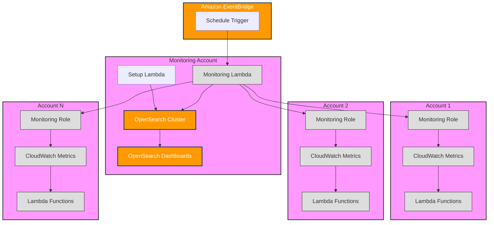

# Lambda Fleet Monitoring Solution

A comprehensive solution for monitoring Lambda functions across multiple AWS accounts using OpenSearch for visualization and analysis.

## Overview

This solution provides real-time monitoring and analytics for AWS Lambda functions across multiple accounts. It collects metrics such as invocations, errors, duration, memory usage, and cold starts, storing them in OpenSearch for analysis and visualization.

## Architecture



## Features

- Cross-account Lambda function monitoring
- Real-time metric collection
- Comprehensive dashboards
- Automated setup and configuration
- Customizable alerting capabilities
- Memory and timeout optimization insights

### Metrics Collected

- Invocation count
- Error rates
- Duration statistics
- Memory utilization
- Cold start frequency
- Timeout proximity
- Runtime distribution
- Cost metrics

## Prerequisites

- AWS CLI configured with appropriate permissions
- Terraform v1.0.0 or later
- Python 3.9 or later
- Cross-account IAM roles configured
- AWS account with permissions to create:
  - Lambda functions
  - OpenSearch domains
  - IAM roles and policies
  - CloudWatch events
  - S3 buckets

## Installation

1. Clone the repository:
```bash
git clone https://github.com/cloudon-one/opensearch-monitoring.git
cd opensearch-monitoring/lambda
```

2. Create a `terraform.tfvars` file:
```hcl
aws_region = "eu-west-1"
monitored_accounts = ["123456789012", "098765432109"]
opensearch_master_user_password = "your-secure-password"
opensearch_instance_type = "t3.small.search"
opensearch_instance_count = 1
opensearch_volume_size = 10
```

3. Initialize Terraform:
```bash
terraform init
```

4. Deploy the solution:
```bash
terraform plan
terraform apply
```
### Security Best Practices

1. Regular Rotation
   - Regularly review and rotate any access keys
   - Monitor and audit role usage

2. Access Logging
   - Enable CloudTrail for API activity logging
   - Monitor assumed role events

3. Least Privilege
   - Regularly review and minimize permissions
   - Remove unused permissions

4. Organization Controls
   - Use AWS Organizations SCPs for additional control
   - Implement compliance policies
