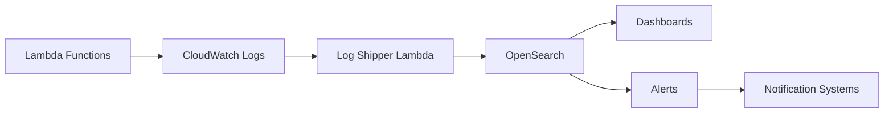

# Lambda Monitoring with OpenSearch

A comprehensive monitoring solution for AWS Lambda functions using OpenSearch for log aggregation, metric analysis, and alerting.

## Table of Contents
- [Features](#features)
- [Architecture](#architecture)
- [Prerequisites](#prerequisites)
- [Installation](#installation)
- [Configuration](#configuration)
- [Usage](#usage)
- [Metrics](#metrics)
- [Alerts](#alerts)
- [Contributing](#contributing)
- [Troubleshooting](#troubleshooting)

## Features

### Core Functionality
- Real-time log aggregation
- Performance metric tracking
- Error detection and analysis
- Cost monitoring
- Health score calculation
- Automated alerting

### Metrics Tracked
- Function duration
- Memory usage
- Error rates
- Cold starts
- Cost (GB-seconds)
- Custom health scores

### Alert Types
- Performance degradation
- Error rate spikes
- Cost surges
- Memory utilization
- Composite health scores

## Architecture



## Prerequisites

1. AWS Services:
   - AWS Lambda
   - Amazon OpenSearch Service
   - CloudWatch Logs
   - IAM roles and permissions

2. Python Dependencies:
```bash
pip install -r requirements.txt
```

3. Required IAM Permissions:
```json
{
    "Version": "2012-10-17",
    "Statement": [
        {
            "Effect": "Allow",
            "Action": [
                "es:ESHttp*",
                "logs:CreateLogGroup",
                "logs:CreateLogStream",
                "logs:PutLogEvents"
            ],
            "Resource": "*"
        }
    ]
}
```

## Installation

1. Deploy OpenSearch Domain:
```bash
aws cloudformation deploy \
    --template-file templates/opensearch.yaml \
    --stack-name lambda-monitoring \
    --capabilities CAPABILITY_IAM
```

2. Deploy Log Shipper:
```bash
# Install dependencies
pip install -r requirements.txt -t ./

# Package the function
zip -r function.zip ./*

# Deploy the function to kenbi-dev account
aws lambda create-function \
    --function-name lambda-log-shipper \
    --runtime python3.9 \
    --handler lambda_monitor.lambda_handler \
    --zip-file fileb://function.zip \
    --role arn:aws:iam::689127934821:role/lambda-log-shipper
```

3. Configure Log Subscription:
```bash
aws logs put-subscription-filter \
    --log-group-name "/aws/lambda/monitoring-function" \
    --filter-name "ship-to-opensearch" \
    --filter-pattern "" \
    --destination-arn "<log-shipper-arn>"
```

## Configuration

### Environment Variables
```bash
OPENSEARCH_ENDPOINT=your-opensearch-endpoint
AWS_REGION=your-aws-region
LOG_LEVEL=INFO
ALERT_WEBHOOK_URL=your-webhook-url
```

### OpenSearch Index Settings
```json
{
    "index_patterns": ["lambda-logs-*"],
    "settings": {
        "number_of_shards": 1,
        "number_of_replicas": 1,
        "index.lifecycle.name": "lambda_logs_policy"
    }
}
```

## Usage

### Basic Implementation
```python
from lambda_monitor import LambdaMonitor

# Initialize monitor
monitor = LambdaMonitor(opensearch_endpoint='your-endpoint')

# Process events
monitor.process_cloudwatch_event(event)

# Get metrics
metrics = monitor.get_metrics(
    function_name='monitoring-function',
    start_time='2024-01-01T00:00:00Z'
)
```

### Creating Alerts
```python
# Create performance alert
alert_config = {
    "name": "High Duration Alert",
    "trigger": {
        "schedule": {"interval": "5m"},
        "condition": {
            "script": {
                "source": "ctx.results[0].aggregations.duration_p95 > 1000"
            }
        }
    }
}
monitor.create_alert(alert_config)
```

### Querying Metrics
```python
# Get function metrics
metrics = monitor.get_metrics(
    function_name='my-function',
    start_time='2024-01-01T00:00:00Z',
    end_time='2024-01-02T00:00:00Z'
)

# Process metrics
for function in metrics['aggregations']['by_function']['buckets']:
    print(f"Function: {function['key']}")
    print(f"Error Rate: {function['error_rate']['value']}%")
    print(f"Avg Duration: {function['duration_stats']['avg']}ms")
```

## Metrics

### Base Metrics
| Metric | Description | Unit |
|--------|-------------|------|
| duration | Function execution time | milliseconds |
| memory_used | Memory consumed | MB |
| error_rate | Rate of errors | percentage |
| cold_starts | Cold start count | count |

### Derived Metrics
| Metric | Calculation | Unit |
|--------|-------------|------|
| memory_utilization | memory_used / max_memory * 100 | percentage |
| cost_gb_seconds | (memory_gb * duration_seconds) | GB-seconds |
| health_score | Composite score based on multiple metrics | 0-100 |

## Alerts

### Available Alert Types
1. Performance Alerts
   - Duration thresholds
   - Memory utilization
   - Cold start frequency

2. Error Alerts
   - Error rate thresholds
   - Error pattern detection
   - Error clustering

3. Cost Alerts
   - Cost thresholds
   - Usage spikes
   - Trend analysis

### Alert Configuration
```json
{
    "name": "Example Alert",
    "severity": "critical",
    "trigger": {
        "schedule": {"interval": "5m"},
        "condition": {
            "script": {
                "source": "ctx.results[0].value > 100"
            }
        }
    },
    "actions": [
        {
            "type": "webhook",
            "url": "your-webhook-url"
        }
    ]
}
```

## Contributing

1. Fork the repository
2. Create your feature branch (`git checkout -b feature/amazing-feature`)
3. Commit your changes (`git commit -m 'Add amazing feature'`)
4. Push to the branch (`git push origin feature/amazing-feature`)
5. Open a Pull Request

## Troubleshooting

### Common Issues

1. OpenSearch Connection Issues
```python
# Check connectivity
monitor = LambdaMonitor(opensearch_endpoint='your-endpoint')
status = monitor.check_connection()
```

2. Missing Metrics
- Verify CloudWatch log format
- Check IAM permissions
- Validate log subscription filters

3. Alert Issues
- Verify alert configurations
- Check webhook endpoints
- Validate alert conditions

### Logging
```python
import logging

logging.getLogger('LambdaMonitor').setLevel(logging.DEBUG)
```

### Health Check
```python
# Run health check
monitor = LambdaMonitor(opensearch_endpoint='your-endpoint')
health = monitor.check_health()

if not health['healthy']:
    print(f"Issues detected: {health['issues']}")
```

## License

This project is licensed under the MIT License - see the LICENSE file for details.

## Acknowledgments

- AWS Lambda team for their excellent documentation
- OpenSearch community for their support
- Contributors who have helped improve this project