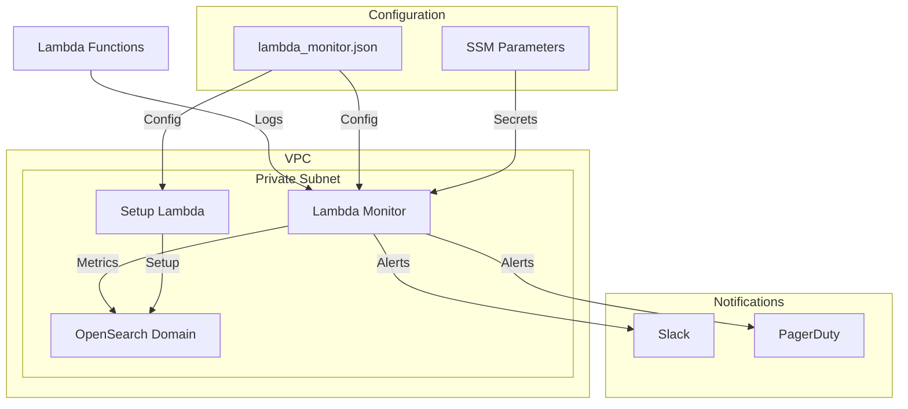

# Lambda Monitoring with OpenSearch

A comprehensive Lambda monitoring solution using OpenSearch, deployed with Terraform and configured via JSON.

## Table of Contents
- [Features](#features)
- [Architecture](#architecture)
- [Prerequisites](#prerequisites)
- [Configuration](#configuration)
- [Deployment](#deployment)
- [Usage](#usage)
- [Maintenance](#maintenance)
- [Troubleshooting](#troubleshooting)

## Features

### Core Functionality
```yaml
Monitoring:
  - Real-time log aggregation
  - Performance metrics tracking
  - Error detection and analysis
  - Cost monitoring
  - Health scoring
  - VPC-based secure deployment

Alerting:
  - Multi-channel notifications (Slack, PagerDuty)
  - Configurable thresholds
  - Severity-based routing
  - Alert throttling
  - Custom alert templates

Storage:
  - Lifecycle management
  - Hot-warm-cold architecture
  - Automatic index rollover
  - Configurable retention
```

## Architecture



## Prerequisites

### Required Tools
```bash
# Core tools
terraform >= 1.5.0
aws-cli >= 2.0.0
python >= 3.9

# AWS credentials configured
aws configure
```

### AWS Requirements
```hcl
# Required AWS services
services = [
  "opensearch",
  "lambda",
  "cloudwatch",
  "ssm",
  "s3",
  "vpc"
]

# VPC requirements
vpc_components = [
  "private_subnets",
  "nat_gateway",
  "security_groups"
]
```

## Configuration

### 1. Configuration File Structure
```json
{
  "opensearch": {
    "index_template": {},
    "index_lifecycle": {}
  },
  "monitoring": {
    "metrics": {}
  },
  "alerts": {
    "settings": {},
    "definitions": {}
  },
  "notifications": {
    "templates": {}
  }
}
```

### 2. Environment Variables
```hcl
# Required variables
required_variables = {
  slack_webhook_url          = "Slack webhook for notifications"
  pagerduty_api_key          = "PagerDuty API key for alerts"
  opensearch_master_user     = "OpenSearch admin username"
  opensearch_master_password = "OpenSearch admin password"
}

# Optional variables
optional_variables = {
  environment = "prod"
  log_level   = "INFO"
}
```

### 3. Security Configuration
```hcl
# SSM Parameters
sensitive_parameters = [
  "slack_webhook_url",
  "pagerduty_api_key"
]

# VPC Access
vpc_config = {
  subnet_ids = ["subnet-xxx"]
  security_group_ids = ["sg-xxx"]
}
```

## Deployment

### 1. Initialize Project
```bash
# Clone repository
git clone git@github.com:cloudon-one/opensearch-monitoring.git
cd opensearch-monitoring/lambda

# Initialize Terraform
terraform init
```

### 2. Configure Environment
```bash
# Set required variables
export TF_VAR_slack_webhook_url="https://hooks.slack.com/..."
export TF_VAR_pagerduty_api_key="your-api-key"
export TF_VAR_opensearch_master_user="admin"
export TF_VAR_opensearch_master_password="secure-password"

# Create terraform.tfvars
cat > terraform.tfvars <<EOF
environment = "prod"
vpc_id = "vpc-xxxxx"
subnet_ids = ["subnet-xxxxx", "subnet-yyyyy"]
EOF
```

### 3. Deploy Infrastructure
```bash
# Validate configuration
terraform validate

# Plan deployment
terraform plan -out=tfplan

# Apply deployment
terraform apply tfplan
```

### 4. Verify Deployment
```bash
# Check OpenSearch endpoint
terraform output opensearch_endpoint

# Verify Lambda function
aws lambda get-function \
    --function-name $(terraform output -raw lambda_function_name)
```

## Usage

### 1. Monitor Metrics
```python
import boto3
import requests
from aws_requests_auth.aws_auth import AWSRequestsAuth

# Get OpenSearch endpoint
opensearch_endpoint = "your-endpoint"

# Query metrics
response = requests.get(
    f"https://{opensearch_endpoint}/lambda-logs-*/_search",
    auth=auth,
    json={
        "size": 0,
        "aggs": {
            "by_function": {
                "terms": {
                    "field": "functionName"
                }
            }
        }
    }
)
```

### 2. Configure Alerts
```python
# Update alert configuration
alert_config = {
    "name": "High Error Rate",
    "severity": "critical",
    "trigger": {
        "schedule": {"interval": "5m"},
        "condition": {
            "script": {
                "source": "ctx.results[0].error_rate > 5"
            }
        }
    }
}

# Create alert
response = requests.post(
    f"https://{opensearch_endpoint}/_plugins/_alerting/monitors",
    auth=auth,
    json=alert_config
)
```

## Maintenance

### 1. Update Configuration
```bash
# Edit configuration
vim lambda_monitor.json

# Apply changes
terraform apply
```

### 2. Rotate Credentials
```bash
# Update SSM parameters
aws ssm put-parameter \
    --name "/lambda-monitor/prod/slack_webhook_url" \
    --value "new-webhook-url" \
    --type SecureString \
    --overwrite

# Restart Lambda function
aws lambda update-function-configuration \
    --function-name lambda-monitor
```

### 3. Monitor Health
```bash
# Check OpenSearch health
curl -X GET "https://${OPENSEARCH_ENDPOINT}/_cluster/health"

# View Lambda metrics
aws cloudwatch get-metric-statistics \
    --namespace AWS/Lambda \
    --metric-name Errors \
    --dimensions Name=FunctionName,Value=lambda-monitor \
    --start-time $(date -u -v-1H +%FT%TZ) \
    --end-time $(date -u +%FT%TZ) \
    --period 300 \
    --statistics Sum
```

## Troubleshooting

### Common Issues

1. OpenSearch Connection
```bash
# Check VPC endpoints
aws ec2 describe-vpc-endpoints \
    --filters Name=vpc-id,Values=${VPC_ID}

# Verify security groups
aws ec2 describe-security-groups \
    --group-ids ${SECURITY_GROUP_ID}
```

2. Lambda Configuration
```bash
# Check environment variables
aws lambda get-function-configuration \
    --function-name lambda-monitor

# View logs
aws logs tail /aws/lambda/lambda-monitor
```

3. Alert Delivery
```bash
# Verify webhook configuration
aws ssm get-parameter \
    --name "/lambda-monitor/prod/slack_webhook_url" \
    --with-decryption

# Test alert delivery
aws lambda invoke \
    --function-name lambda-monitor \
    --payload '{"test": true}' response.json
```

### Health Checks
```bash
# Infrastructure health
terraform plan # Check for drift

# OpenSearch indices
curl -X GET "https://${OPENSEARCH_ENDPOINT}/_cat/indices?v"

# Lambda execution
aws lambda invoke \
    --function-name lambda-monitor \
    --payload '{"healthCheck": true}' response.json
```

## License

This project is licensed under the MIT License - see the LICENSE file for details.