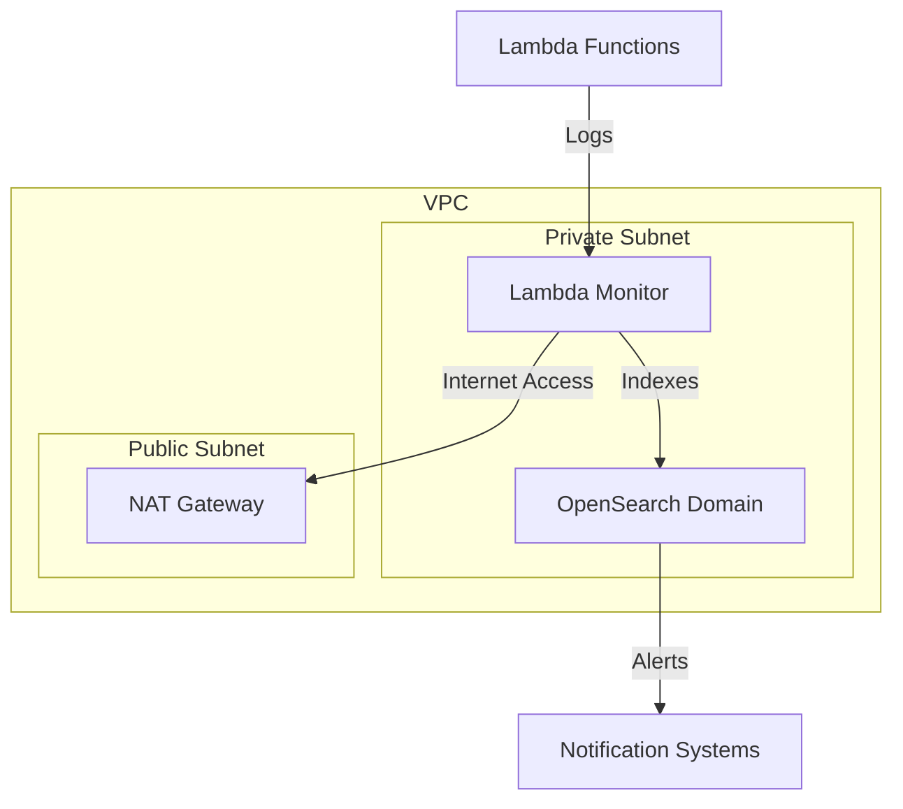

# Lambda Monitoring with OpenSearch

A comprehensive Lambda monitoring solution using OpenSearch, deployed with Terraform.

## Table of Contents
- [Features](#features)
- [Architecture](#architecture)
- [Prerequisites](#prerequisites)
- [Deployment](#deployment)
  - [Quick Start](#quick-start)
  - [Advanced Configuration](#advanced-configuration)
  - [Multiple Environments](#multiple-environments)
- [Usage](#usage)
- [Metrics](#metrics)
- [Alerts](#alerts)
- [Maintenance](#maintenance)
- [Troubleshooting](#troubleshooting)

## Features

### Core Functionality
- Real-time log aggregation and analysis
- Performance metric tracking
- Error detection and analysis
- Cost monitoring
- Health score calculation
- Automated alerting
- VPC-based secure deployment
- Cross-account monitoring support

### Monitored Metrics
```yaml
Performance:
  - Function duration
  - Memory usage
  - Cold starts
  - Throttling events

Errors:
  - Error rates
  - Exception patterns
  - Stack traces
  - Timeout occurrences

Cost:
  - GB-seconds usage
  - Invocation costs
  - Memory optimization
  - Duration trends
```

## Architecture



## Prerequisites

### Required Tools
```bash
# Terraform version 1.0+
terraform version

# AWS CLI configured
aws configure

# Python 3.9+ (for local development)
python --version
```

### AWS Resources
- VPC with private subnets
- NAT Gateway/Instance
- S3 bucket for Terraform state
- Route53 Hosted Zone (optional)

### Access Requirements
```hcl
# Minimum IAM permissions for deployment
{
  "Version": "2012-10-17",
  "Statement": [
    {
      "Effect": "Allow",
      "Action": [
        "lambda:*",
        "es:*",
        "ec2:*",
        "iam:*",
        "logs:*",
        "s3:*",
        "kms:*"
      ],
      "Resource": "*"
    }
  ]
}
```

## Deployment

### Quick Start

1. Clone and initialize:
```bash
git clone git@github.com:cloudon-one/opensearch-monitoring.git
cd opensearch-monitoring/lambda
terraform init
```

2. Create terraform.tfvars:
```hcl
# Infrastructure Configuration
aws_region         = "eu-west-1"
environment        = "prod"
project_name       = "lambda-monitor"

# VPC Configuration
vpc_id             = "vpc-xxxxx"
subnet_ids         = ["subnet-xxxxx", "subnet-yyyyy"]

# OpenSearch Configuration
opensearch_instance_type  = "t3.small.search"
opensearch_instance_count = 1
opensearch_volume_size    = 10

# Security Configuration
opensearch_master_user     = "admin"
opensearch_master_password = "your-secure-password"

# Monitoring Configuration
alert_webhook_url = "https://your-webhook-url"
log_retention_days = 30
```

3. Package function code:
```bash
# Create Lambda package
make package-lambda

# Or manually
zip -r function.zip lambda_monitor.py
zip -r layer.zip python/
```

4. Deploy:
```bash
terraform plan -out=tfplan
terraform apply tfplan
```

### Advanced Configuration

#### Custom Domain Configuration
```hcl
# terraform.tfvars
domain_name = "monitor.example.com"
create_custom_domain = true
route53_zone_id = "Z123456789ABC"
```

#### Enhanced Security Configuration
```hcl
# terraform.tfvars
enable_encryption = true
create_kms_key = true
enable_vpc_endpoints = true
enable_waf = true
```

#### High Availability Setup PROD
```hcl
# terraform.tfvars
opensearch_instance_count = 3
multi_az = true
zone_awareness_enabled = true
```

### Multiple Environments

Using Terraform workspaces:
```bash
# Create workspaces
terraform workspace new dev
terraform workspace new staging
terraform workspace new prod

# Select workspace
terraform workspace select dev

# Deploy with environment-specific vars
terraform apply -var-file="env/dev.tfvars"
```

## Usage

### Monitoring Examples

1. Get function metrics:
```python
# Using boto3
import boto3

client = boto3.client('opensearch')
domain_endpoint = client.describe_domain(
    DomainName=domain_name
)['DomainStatus']['Endpoints']['vpc']
```

2. Configure alerts:
```python
from lambda_monitor import LambdaMonitor

monitor = LambdaMonitor(opensearch_endpoint=domain_endpoint)
monitor.create_alert({
    "name": "High Error Rate",
    "trigger": {
        "schedule": {"interval": "5m"},
        "condition": {
            "script": "ctx.results[0].error_rate > 5"
        }
    }
})
```

## Metrics

### Performance Metrics
| Metric | Description | Threshold | Alert |
|--------|-------------|-----------|--------|
| duration_p95 | 95th percentile duration | 1000ms | High |
| memory_utilization | Memory usage percentage | 80% | Medium |
| cold_start_rate | Cold start percentage | 10% | Low |

### Cost Metrics
| Metric | Description | Threshold | Alert |
|--------|-------------|-----------|--------|
| gb_seconds | GB-seconds consumed | Varies | Medium |
| invocation_cost | Cost per invocation | $0.01 | Low |
| total_cost | Daily cost | $100 | High |

## Maintenance

### Regular Tasks
```bash
# Update dependencies
terraform init -upgrade

# Plan infrastructure updates
terraform plan

# Apply security patches
terraform apply -target=aws_opensearch_domain.monitoring

# Rotate credentials
terraform taint aws_secretsmanager_secret.opensearch_master
terraform apply
```

### Backup and Restore
```bash
# Backup OpenSearch indices
curl -X PUT "https://${domain_endpoint}/_snapshot/backup_repository"

# Restore from snapshot
curl -X POST "https://${domain_endpoint}/_snapshot/backup_repository/snapshot_1/_restore"
```

## Troubleshooting

### Common Issues

1. OpenSearch Connection:
```bash
# Test VPC connectivity
aws ec2 describe-network-interfaces \
    --filters Name=vpc-id,Values=${vpc_id}

# Check security groups
aws ec2 describe-security-groups \
    --group-ids ${security_group_id}
```

2. Lambda Deployment:
```bash
# Check Lambda logs
aws logs tail /aws/lambda/${function_name}

# Test IAM permissions
aws iam simulate-principal-policy \
    --policy-source-arn ${role_arn} \
    --action-names lambda:InvokeFunction
```

3. Metric Collection:
```bash
# Verify log subscription
aws logs describe-subscription-filters \
    --log-group-name /aws/lambda/${function_name}

# Check OpenSearch indices
curl -X GET "https://${domain_endpoint}/_cat/indices?v"
```

### Health Checks
```bash
# Check OpenSearch health
curl -X GET "https://${domain_endpoint}/_cluster/health"

# Verify Lambda configuration
aws lambda get-function-configuration \
    --function-name ${function_name}

# Test alerting
aws lambda invoke \
    --function-name ${function_name} \
    --payload '{"test": true}' response.json
```

### Infrastructure Validation
```bash
# Validate Terraform configuration
terraform validate

# Check for drift
terraform plan

# Review state
terraform show
```

## Best Practices

### Security
- Use KMS encryption for sensitive data
- Implement least privilege IAM roles
- Enable VPC endpoints for AWS services
- Use security groups for network isolation

### Performance
- Right-size OpenSearch instances
- Configure appropriate shard counts
- Use dedicated master nodes for larger clusters
- Implement index lifecycle management

### Cost Optimization
- Use auto-scaling policies
- Implement log retention policies
- Monitor resource utilization
- Use reserved instances for OpenSearch

## License

This project is licensed under the MIT License - see the LICENSE file for details.