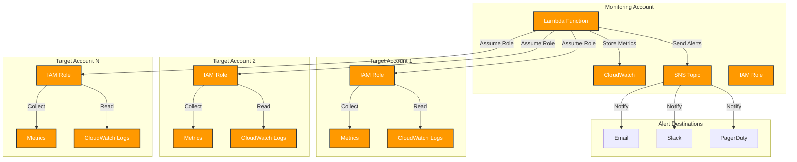

# Multi-Account Lambda Monitoring

This project implements a Lambda-based monitoring solution that can collect metrics and generate alerts across multiple AWS accounts.

## Architecture



The solution consists of:
- A Lambda function that collects metrics across accounts
- IAM roles for cross-account access
- CloudWatch metrics and logs integration
- SNS-based alerting system

## Prerequisites

1. AWS CLI installed and configured
2. Terraform >= 1.0.0
3. Access to all target AWS accounts
4. Permissions to create IAM roles and Lambda functions

## Deployment Steps

### 1. Create IAM Roles in Target Accounts

For each target account, create an IAM role with the following trust relationship:

```json
{
  "Version": "2012-10-17",
  "Statement": [
    {
      "Effect": "Allow",
      "Principal": {
        "AWS": "arn:aws:iam::<MONITORING_ACCOUNT_ID>:root"
      },
      "Action": "sts:AssumeRole"
    }
  ]
}
```

Required permissions for the role:
```json
{
  "Version": "2012-10-17",
  "Statement": [
    {
      "Effect": "Allow",
      "Action": [
        "cloudwatch:GetMetricData",
        "cloudwatch:GetMetricStatistics",
        "cloudwatch:ListMetrics",
        "logs:FilterLogEvents",
        "logs:GetLogEvents",
        "logs:DescribeLogGroups"
      ],
      "Resource": "*"
    }
  ]
}
```

### 2. Configure Variables

Create a `terraform.tfvars` file:

```hcl
function_name = "multi-account-monitor"
memory_size = 256
timeout = 300
environment_variables = {
  LOG_LEVEL = "INFO"
}
target_account_roles = [
  "arn:aws:iam::111111111111:role/monitoring-role",
  "arn:aws:iam::222222222222:role/monitoring-role"
]
schedule_expression = "rate(5 minutes)"
```

### 3. Update Configuration

1. Edit `lambda_monitor.json`:
   - Update SNS topic ARNs for alert routing
   - Adjust monitoring thresholds if needed
   - Configure storage lifecycle settings

2. Verify Lambda function code in `lambda_function.py`

### 4. Deploy the Solution

```bash
# Initialize Terraform
terraform init

# Plan the deployment
terraform plan

# Apply the changes
terraform apply
```

### 5. Verify Deployment

1. Check Lambda function in AWS Console
2. Verify CloudWatch Log Group creation
3. Test SNS topic subscriptions

## Debugging Guide

### 1. CloudWatch Logs

Monitor Lambda execution:
```bash
aws logs get-log-events \
  --log-group-name "/aws/lambda/multi-account-monitor" \
  --log-stream-name "$(aws logs describe-log-streams \
    --log-group-name "/aws/lambda/multi-account-monitor" \
    --order-by LastEventTime \
    --descending \
    --limit 1 \
    --query 'logStreams[0].logStreamName' \
    --output text)"
```

### 2. Common Issues and Solutions

#### Cross-Account Access Issues

1. Check IAM role trust relationships:
```bash
aws iam get-role --role-name monitoring-role
```

2. Verify role permissions:
```bash
aws iam get-role-policy --role-name monitoring-role --policy-name permissions
```

3. Test role assumption:
```bash
aws sts assume-role \
  --role-arn "arn:aws:iam::TARGET_ACCOUNT_ID:role/monitoring-role" \
  --role-session-name "TestSession"
```

#### Metric Collection Issues

1. Check CloudWatch metrics existence:
```bash
aws cloudwatch list-metrics \
  --namespace "AWS/Lambda" \
  --metric-name "Duration"
```

2. Test metric retrieval:
```bash
aws cloudwatch get-metric-statistics \
  --namespace "AWS/Lambda" \
  --metric-name "Duration" \
  --dimensions Name=FunctionName,Value=multi-account-monitor \
  --start-time "$(date -u -v-1H '+%Y-%m-%dT%H:%M:%SZ')" \
  --end-time "$(date -u '+%Y-%m-%dT%H:%M:%SZ')" \
  --period 300 \
  --statistics Average
```

#### Alert Issues

1. Verify SNS topic:
```bash
aws sns list-subscriptions-by-topic \
  --topic-arn "YOUR_SNS_TOPIC_ARN"
```

2. Test SNS publishing:
```bash
aws sns publish \
  --topic-arn "YOUR_SNS_TOPIC_ARN" \
  --message "Test alert message"
```

### 3. Monitoring the Monitor

1. Set up CloudWatch Alarms for the monitoring function:
```bash
aws cloudwatch put-metric-alarm \
  --alarm-name "MonitoringFunctionErrors" \
  --alarm-description "Alert on monitoring function errors" \
  --metric-name "Errors" \
  --namespace "AWS/Lambda" \
  --dimensions Name=FunctionName,Value=multi-account-monitor \
  --period 300 \
  --evaluation-periods 1 \
  --threshold 1 \
  --comparison-operator GreaterThanThreshold \
  --statistic Sum
```

2. Monitor function duration:
```bash
aws cloudwatch put-metric-alarm \
  --alarm-name "MonitoringFunctionDuration" \
  --alarm-description "Alert on high function duration" \
  --metric-name "Duration" \
  --namespace "AWS/Lambda" \
  --dimensions Name=FunctionName,Value=multi-account-monitor \
  --period 300 \
  --evaluation-periods 1 \
  --threshold 250000 \
  --comparison-operator GreaterThanThreshold \
  --statistic Average
```

## Testing

### 1. Manual Invocation

Test the function with a sample event:
```bash
aws lambda invoke \
  --function-name multi-account-monitor \
  --payload '{}' \
  response.json
```

### 2. Verify Metrics

Check collected metrics:
```bash
aws cloudwatch get-metric-data \
  --metric-data-queries '[{
    "Id": "m1",
    "MetricStat": {
      "Metric": {
        "Namespace": "CustomMetrics",
        "MetricName": "HealthScore",
        "Dimensions": [{"Name": "FunctionName", "Value": "multi-account-monitor"}]
      },
      "Period": 300,
      "Stat": "Average"
    },
    "ReturnData": true
  }]' \
  --start-time "$(date -u -v-1H '+%Y-%m-%dT%H:%M:%SZ')" \
  --end-time "$(date -u '+%Y-%m-%dT%H:%M:%SZ')"
```

### 3. End-to-End Testing

1. Deploy to a test environment
2. Configure test accounts with sample data
3. Verify metric collection across accounts
4. Test alert generation and delivery
5. Validate storage lifecycle management

## Maintenance

### 1. Regular Tasks

- Review and update monitoring thresholds
- Verify IAM role permissions
- Check CloudWatch Log retention
- Monitor Lambda function versions

### 2. Updating the Function

1. Make code changes
2. Update configuration if needed
3. Deploy using Terraform
4. Verify changes in CloudWatch Logs

### 3. Backup and Recovery

- Keep configuration in version control
- Document all custom thresholds
- Maintain list of monitored accounts
- Store alert routing settings

## Support

For issues and support:
1. Check CloudWatch Logs
2. Review IAM permissions
3. Verify network connectivity
4. Check SNS topic configuration
