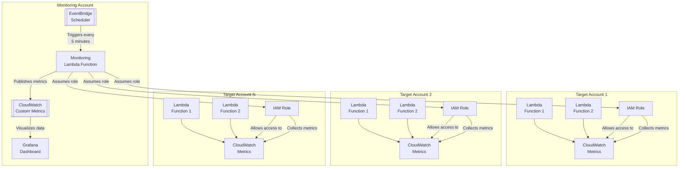

# Cross-Account Lambda Monitoring Solution

A comprehensive monitoring solution for AWS Lambda functions across multiple AWS accounts. This solution provides centralized monitoring, metrics collection, and visualization through Grafana dashboards.

## Table of Contents
- [Architecture](#architecture)
- [Features](#features)
- [Prerequisites](#prerequisites)
- [Deployment Guide](#deployment-guide)
  - [1. Prepare Target Accounts](#1-prepare-target-accounts)
  - [2. Prepare Deployment Files](#2-prepare-deployment-files)
  - [3. Deploy Infrastructure](#3-deploy-infrastructure)
  - [4. Configure Grafana](#4-configure-grafana)
  - [5. Verify Deployment](#5-verify-deployment)
  - [6. Troubleshooting](#6-troubleshooting)
  - [7. Maintenance](#7-maintenance)
- [Security Considerations](#security-considerations)
- [Metrics Reference](#metrics-reference)
- [Contributing](#contributing)
- [Support](#support)
- [References](#references)

## Architecture



## Features

- Cross-account Lambda function monitoring
- Automated metrics collection every 5 minutes
- Centralized CloudWatch metrics storage
- Pre-configured Grafana dashboards
- Terraform-based deployment
- Scalable to multiple AWS accounts

### Metrics Collected
- Invocation counts
- Error rates
- Duration metrics
- Throttling events
- Concurrent executions
- Iterator age (for stream-based functions)

## Prerequisites

- AWS CLI installed and configured with administrator access to the monitoring account
- Terraform (version 1.0.0 or higher)
- Python 3.9 or higher
- Git (optional, for version control)

## Deployment Guide

### 1. Prepare Target Accounts

#### 1.1. Create IAM Role in Target Accounts
1. Log into each target AWS account
2. Create a new IAM role with the following trust relationship:
```json
{
    "Version": "2012-10-17",
    "Statement": [
        {
            "Effect": "Allow",
            "Principal": {
                "AWS": "arn:aws:iam::<MONITORING_ACCOUNT_ID>:role/lambda_monitoring_role"
            },
            "Action": "sts:AssumeRole"
        }
    ]
}
```

3. Attach the following IAM policy to the role:
```json
{
    "Version": "2012-10-17",
    "Statement": [
        {
            "Effect": "Allow",
            "Action": [
                "lambda:ListFunctions",
                "cloudwatch:GetMetricStatistics",
                "cloudwatch:ListMetrics"
            ],
            "Resource": "*"
        }
    ]
}
```

4. Note down the ARN of each created role

### 2. Prepare Deployment Files

#### 2.1. Clone and Setup Project
```bash
# Clone repository
git clone https://github.com/yourusername/lambda-monitoring.git
cd lambda-monitoring

# Create deployment package
zip lambda_function.zip lambda_function.py
```

#### 2.2. Configure Terraform Variables
Create `terraform.tfvars` with your account configurations:
```hcl
monitoring_accounts = [
  {
    account_id = "111111111111"
    region     = "us-east-1"
    role_arn   = "arn:aws:iam::111111111111:role/LambdaMonitoringRole"
  },
  {
    account_id = "222222222222"
    region     = "us-east-1"
    role_arn   = "arn:aws:iam::222222222222:role/LambdaMonitoringRole"
  }
]

schedule_expression = "rate(5 minutes)"
```

### 3. Deploy Infrastructure

```bash
# Initialize Terraform
terraform init

# Verify the deployment plan
terraform plan

# Apply the configuration
terraform apply
```

### 4. Configure Grafana

#### 4.1. Set Up CloudWatch Data Source
1. Log into your Grafana instance
2. Go to Configuration → Data Sources
3. Add new CloudWatch data source
4. Configure:
   - Name: CloudWatch
   - Auth Provider: Access & secret key
   - Access Key ID: Enter your AWS access key
   - Secret Access Key: Enter your AWS secret key
   - Default Region: Select your primary monitoring region
5. Click "Save & Test"

#### 4.2. Import Dashboard
1. Go to Dashboards → Import
2. Copy the provided Grafana dashboard JSON from `grafana/dashboard.json`
3. Click "Load" and then "Import"

### 5. Verify Deployment

#### 5.1. Check Lambda Function
1. Go to AWS Lambda console
2. Verify `lambda_cross_account_monitoring` function
3. Check CloudWatch Logs
4. Verify metrics in CloudWatch under `CustomLambdaMonitoring` namespace

#### 5.2. Verify Grafana Dashboard
1. Wait 5-10 minutes for initial data collection
2. Open the imported dashboard
3. Verify metrics display for all accounts

### 6. Troubleshooting

#### Common Issues and Solutions

**No Data in Grafana**
- Verify CloudWatch data source configuration
- Check Lambda function execution logs
- Ensure IAM roles have correct permissions
- Verify target account role ARNs

**Lambda Function Errors**
- Check CloudWatch Logs for error messages
- Verify environment variables
- Ensure Lambda execution role permissions
- Check network connectivity if in VPC

**Cross-Account Access Issues**
- Verify trust relationships
- Check role ARNs
- Ensure correct policies
- Verify account IDs

### 7. Maintenance

#### 7.1. Adding New Accounts
1. Create IAM role in new account (follow section 1.1)
2. Add account configuration to `terraform.tfvars`
3. Run `terraform apply`

#### 7.2. Updating Configuration
1. Modify `terraform.tfvars` or `main.tf`
2. Run `terraform plan`
3. Run `terraform apply`

#### 7.3. Monitoring and Alerts
1. Set up CloudWatch Alarms
2. Configure Grafana alerting
3. Review metrics regularly

## Security Considerations

- Rotate AWS access keys regularly
- Review IAM roles and policies periodically
- Monitor for unauthorized access
- Keep components updated
- Follow least privilege principle
- Implement proper Grafana access controls
- Regular security audits
- Encrypt sensitive data

## Metrics Reference

| Metric Name | Description | Unit | Aggregation |
|------------|-------------|------|-------------|
| Invocations | Number of function invocations | Count | Sum |
| Errors | Failed invocations | Count | Sum |
| Duration | Execution time | Milliseconds | Average |
| Throttles | Throttled invocations | Count | Sum |
| ConcurrentExecutions | Concurrent executions | Count | Average |
| IteratorAge | Stream record age | Milliseconds | Average |

## Contributing

1. Fork the repository
2. Create a feature branch
3. Commit your changes
4. Push to the branch
5. Create a Pull Request

## Support

For support:
1. Check this documentation
2. Open an issue
3. Contact maintainers

## References

- [AWS Lambda Documentation](https://docs.aws.amazon.com/lambda/)
- [Terraform Documentation](https://www.terraform.io/docs)
- [Grafana Documentation](https://grafana.com/docs/)
- [CloudWatch Documentation](https://docs.aws.amazon.com/cloudwatch/)